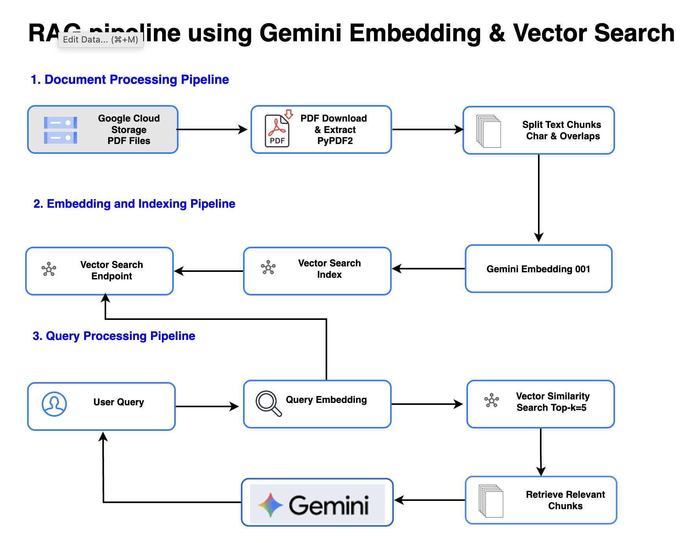

# RAG Pipeline using Vertex AI Vector Search with Gemini Embedding

This project implements a Retrieval-Augmented Generation (RAG) system using Google Cloud's Vertex AI services, specifically leveraging the `gemini-embedding-001` model for embeddings and Vertex AI Vector Search for similarity search.

## Table of Contents
- [Architecture](#architecture)
- [Features](#features)
- [Prerequisites](#prerequisites)
- [Setup](#setup)
- [Usage](#usage)
- [Implementation Details](#implementation-details)
- [Key Achievements](#key-achievements)
- [Notes](#notes)

## Architecture

### RAG Pipeline Architecture


### RAG Debug Mode with Vector Search Logging


### Gemini Embedding & Vector Search Architecture


### 1. Document Processing Pipeline

The pipeline begins with document preparation for embedding and indexing:

**Google Cloud Storage (GCS)**: Source PDFs are stored securely in GCS, enabling scalable ingestion and easy access to enterprise datasets.

**PDF Download & Extract (PyPDF2)**: Using PyPDF2, the system downloads and extracts raw text from PDFs for further processing.

**Split Text Chunks**: The extracted text is split into smaller chunks (e.g., 1,000 characters with 100-character overlaps). Chunking helps balance context granularity with embedding efficiency.

### 2. Embedding and Indexing Pipeline

Once documents are chunked, they are converted into semantic vectors and stored for retrieval:

**Gemini Embedding 001**: Each text chunk is converted into a 3072-dimensional vector using Google's Gemini embedding model, capturing rich semantic meaning.

**Vector Search Index**: Embeddings are stored in a Vector Search index. The index is configured with:
- STREAM_UPDATE for real-time ingestion of new documents.
- DOT_PRODUCT as the similarity metric for fast, precise matching.

**Vector Search Endpoint**: The index is exposed as an endpoint, providing APIs for downstream query handling and integration.

### 3. Query Processing Pipeline

The final stage handles user queries and delivers contextual answers:

**User Query**: Users input natural language questions into the system.

**Query Embedding**: The query is embedded using the same Gemini model, ensuring it resides in the same semantic vector space as the documents.

**Vector Similarity Search**: The query embedding is compared against the index to retrieve the top-k most relevant chunks (commonly k=5).

**Retrieve Relevant Chunks**: The most relevant pieces of text are assembled as the knowledge context.

**Gemini**: The retrieved context, combined with the original query, is passed to Gemini 2.5 Pro, which generates a multi-paragraph response grounded in the document corpus.

## Features

- **Grounded Responses**: Answers are tied directly to your documents rather than generalized model knowledge
- **Scalable & Real-Time**: With GCS and Vector Search (STREAM_UPDATE), the system can scale with continuous document ingestion
- **Semantic Precision**: Gemini embeddings ensure deep semantic understanding, while vector similarity search efficiently finds relevant chunks
- **Direct Content Storage**: Text stored in Vector Search metadata using the `restricts` field (no external database needed)
- **Detailed Responses**: Multi-paragraph answers grounded in document context
- **PDF Processing**: Functionality to process PDF documents from Google Cloud Storage, extract text, and chunk it appropriately
- **Debug Mode**: Enhanced logging and visualization for RAG pipeline debugging and performance analysis

## Prerequisites

- Google Cloud project with Vertex AI API enabled
- Python 3.8+
- Required packages: 
  - google-cloud-aiplatform
  - google-generativeai
  - PyPDF2
  - rich (for debug mode visualization)

## Step-by-Step Setup Guide

### Step 1: Set up a virtual environment

```bash
# Clone the repository
git clone https://github.com/arjunprabhulal/rag-vertex-ai-vector-search.git
cd rag-vertex-ai-vector-search

# Setup virtual environment (Mac or Unix)
python -m venv .venv && source .venv/bin/activate

# Setup virtual environment (Windows)
python -m venv .venv && .venv\Scripts\activate
```

### Step 2: Install dependencies

```bash
# Install dependencies
pip install -r requirements.txt
```

### Step 3: Configure GCP Project and permissions

```bash
# Configure your Google Cloud project
export GOOGLE_CLOUD_PROJECT="your-project-id"
export GOOGLE_CLOUD_LOCATION="us-central1"

# Enable required Google Cloud services
gcloud services enable aiplatform.googleapis.com --project=${GOOGLE_CLOUD_PROJECT}
gcloud services enable storage.googleapis.com --project=${GOOGLE_CLOUD_PROJECT}

# Set up IAM permissions
gcloud projects add-iam-policy-binding ${GOOGLE_CLOUD_PROJECT} \
    --member="user:YOUR_EMAIL@domain.com" \
    --role="roles/aiplatform.user"
gcloud projects add-iam-policy-binding ${GOOGLE_CLOUD_PROJECT} \
    --member="user:YOUR_EMAIL@domain.com" \
    --role="roles/storage.objectAdmin"

# Set up authentication credentials
gcloud auth application-default login
```

### Step 4: Configuration Setup

Edit the configuration variables in both Python files:

```python
# In vector_search_index.py and query_vector_search.py
PROJECT_ID = "your-project-id"  # Your Google Cloud project ID
LOCATION = "us-central1"        # Google Cloud region
MODEL_NAME = "gemini-embedding-001"
EMBED_DIM = 3072
INDEX_DNAME = "gemini-vector-search-index"
ENDPT_DNAME = "gemini-vector-search-endpoint"
DEPLOYED_ID = "gemini_vector_search_deployed"

# For vector_search_index.py, also update:
PDF_URL = "gs://your-bucket-name/your-document.pdf"
```

### Step 5: Create and Deploy Vector Search Index

Run the vector search index creation script:

```bash
python vector_search_index.py
```

This script will:
1. Download the PDF document from your GCS bucket
2. Extract text from the PDF using PyPDF2
3. Split the text into chunks with configurable size and overlap
4. Create a Vector Search index with the following configuration:
   - Tree-AH algorithm
   - STREAM_UPDATE for real-time ingestion
   - DOT_PRODUCT distance metric
   - 3072-dimensional vectors
5. Create a Vector Search endpoint with public access
6. Deploy the index to the endpoint
7. Embed text chunks using Gemini Embedding 001
8. Store embeddings and text content in Vector Search

The script will output:
- Index name
- Endpoint name
- Success/failure messages for each step

### Step 6: Query the Vector Search Index

Once your index is created and populated, you can query it:

```bash
python query_vector_search.py
```

This script will:
1. Take a sample query about "Mixture of Experts (MoE)"
2. Embed the query using Gemini Embedding 001
3. Search the Vector Search index for similar content
4. Retrieve the most relevant text chunks
5. Generate a comprehensive answer using Gemini 2.5 Pro

### Step 7: Customize for Your Use Case

To use this system with your own data:

1. Upload your PDF documents to Google Cloud Storage
2. Update the `PDF_URL` in vector_search_index.py
3. Run the vector_search_index.py script to create a new index
4. Modify query_vector_search.py to use your own queries
5. Run query_vector_search.py to get answers based on your documents

## Implementation Details

### Create Vector Search Infrastructure (vector_search_index.py)

```python
# Create Vector Search Index
index = MatchingEngineIndex.create_tree_ah_index(
    display_name=INDEX_DNAME,
    dimensions=EMBED_DIM,
    index_update_method="STREAM_UPDATE",
    distance_measure_type=aiplatform.matching_engine.matching_engine_index_config
        .DistanceMeasureType.DOT_PRODUCT_DISTANCE,
    description="Index for Mixture of Experts content",
    approximate_neighbors_count=150,
)

# Create Vector Search Endpoint
endpoint = MatchingEngineIndexEndpoint.create(
    display_name=ENDPT_DNAME,
    public_endpoint_enabled=True,
    description="Endpoint for Mixture of Experts index",
)

# Deploy Index to Endpoint
endpoint.deploy_index(index=index, deployed_index_id=DEPLOYED_ID)
```

### Generate Embeddings with Gemini

```python
resp = genai_client.models.embed_content(
    model=MODEL_NAME,
    contents=texts,
    config=EmbedContentConfig(
        task_type="RETRIEVAL_DOCUMENT",
        output_dimensionality=dim
    ),
)
embeddings = [e.values for e in resp.embeddings]
```

### Generate Answer with Gemini

```python
# Combine Retrieved Chunks
context = "\n\n".join(retrieved_chunks)

# Create Prompt with Context
prompt = f"""Use only the context to answer. Provide a detailed and comprehensive response with thorough explanations. Include all relevant information from the context. If the context doesn't contain relevant information, say "I don't have enough information to answer this question."

Context:
{context}

Question: {question}
Answer (provide a detailed explanation with at least 3-6 paragraphs):"""

# Generate Answer
model = GenerativeModel("gemini-2.5-pro")
answer = model.generate_content(prompt).text
```

## Notes

- Vector Search index creation is a long-running operation that may take several minutes
- The first run will take longer as it creates resources and processes the document
- Subsequent runs can reuse the created resources

## Project Structure

```
rag-gemini-embedding/
├── Images/
│   ├── rag-gemini-embedding-vector-search-architecture.png  # Architecture diagram
│   ├── rag-vector-search.gif                               # Animation of RAG process
│   └── rag-debug-vector-search-logging.gif                 # Debug mode with logging
├── vector_search_index.py       # Creates and deploys Vector Search index
├── query_vector_search.py       # Queries the index and generates answers
├── rag_debug_logging.py         # Debug version with additional logging
├── rag_process_log.py           # Log processing and visualization
├── new_vector_search_mapping.json   # Backup mapping of chunk IDs to content
├── requirements.txt             # Project dependencies
└── README.md                    # Project documentation
```

## Example Workflow

Below is a complete example workflow showing how to set up the RAG system with a PDF document:

### 1. Prepare your document

1. Upload your PDF to Google Cloud Storage:
   ```bash
   gsutil cp your-document.pdf gs://your-bucket-name/
   ```

2. Update the PDF_URL in vector_search_index.py:
   ```python
   PDF_URL = "gs://your-bucket-name/your-document.pdf"
   ```

### 2. Create and deploy the Vector Search index

1. Run the index creation script:
   ```bash
   python vector_search_index.py
   ```

2. The script will output the index and endpoint names:
   ```
   Created index: projects/your-project-id/locations/us-central1/indexes/1234567890
   Created endpoint: projects/your-project-id/locations/us-central1/indexEndpoints/0987654321
   ```

3. Save these values for future reference.

### 3. Query the system

1. Update the index endpoint and deployed index ID in query_vector_search.py:
   ```python
   INDEX_ENDPOINT = "projects/your-project-id/locations/us-central1/indexEndpoints/0987654321"
   DEPLOYED_INDEX_ID = "gemini_vector_search_deployed"
   API_ENDPOINT = "1234567890.us-central1-your-project-id.vdb.vertexai.goog"
   ```

2. Run the query script:
   ```bash
   python query_vector_search.py
   ```

3. View the results, which include:
   - Retrieved document chunks
   - Relevance scores
   - Generated answer from Gemini 2.5 Pro
