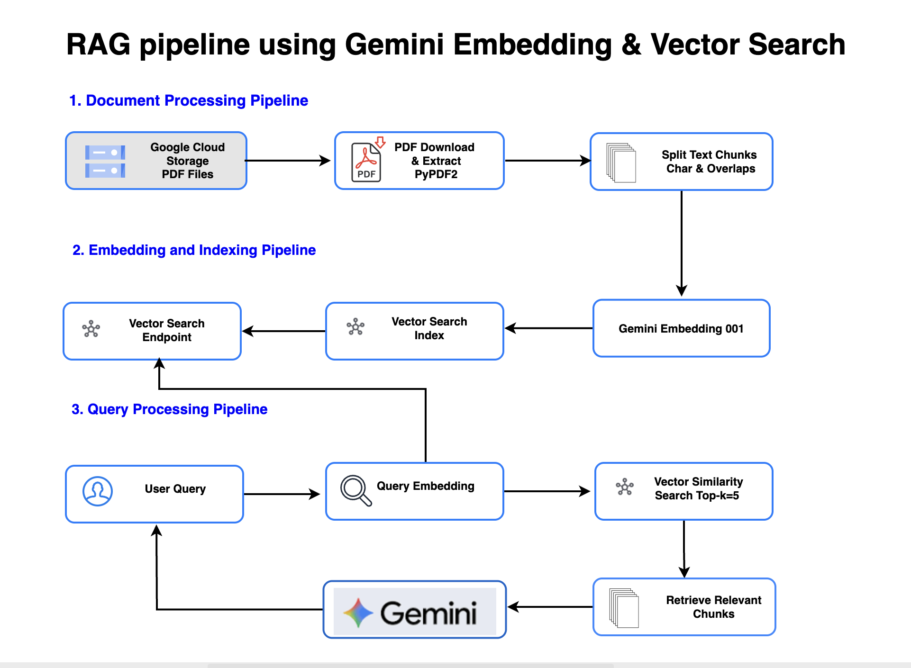

# Build a RAG Pipeline with Gemini Embeddings and Vector Search- A Deep Dive (Full Code)




## Table of Contents
- [Introduction](#introduction)
- [What is Text Embedding?](#what-is-text-embedding)
- [Why Use Embeddings?](#why-use-embeddings)
- [Use Cases of Embeddings](#use-cases-of-embeddings)
- [What are Gemini Embeddings?](#what-are-gemini-embeddings)
  - [Features of Gemini Embeddings](#features-of-gemini-embeddings)
- [Why RAG Needs Embeddings?](#why-rag-needs-embeddings)
- [Architecture - RAG with Gemini Embedding & Vector Search](#architecture---rag-with-gemini-embedding--vector-search)
  - [1. Document Processing Pipeline](#1-document-processing-pipeline)
  - [2. Embedding and Indexing Pipeline](#2-embedding-and-indexing-pipeline)
  - [3. Query Processing Pipeline](#3-query-processing-pipeline)
- [Implementation](#implementation)
  - [Pre-Requisites](#pre-requisites)
  - [Project Structure](#project-structure)
  - [Step 1: Set up a virtual environment](#step-1-set-up-a-virtual-environment)
  - [Step 2: Install dependencies](#step-2-install-dependencies)
  - [Step 3: Configure GCP Project and permissions](#step-3-configure-gcp-project-and-permissions)
  - [Step 4: Configuration Setup](#step-4-configuration-setup)
  - [Step 5: Create & deploy Vector Search index](#step-5-create--deploy-vector-search-index)
  - [Step 6: Upsert Documents](#step-6-upsert-documents)
  - [Step 7: Query Nearest Neighbors](#step-7-query-nearest-neighbors)
  - [Step 8: Demo](#step-8-demo)
- [Cost](#cost)
- [GitHub Repository](#github-repository)
- [Troubleshooting](#troubleshooting)
  - [Common Exception](#common-exception)
- [Conclusion](#conclusion)

## Introduction

Google recently announced the general availability (GA) of its first Gemini text embedding model, gemini-embedding-001, now accessible through the Gemini API and Vertex AI. This model has consistently led the Massive Text Embedding Benchmark (MTEB) Multilingual leaderboard, outperforming both legacy Google models and even the strongest third-party embeddings.

In this article, we'll first explore what text embeddings are and why they matter for modern AI applications such as semantic search, classification, and Retrieval-Augmented Generation (RAG). Then, we'll dive deeper into Gemini embeddings and show how to use them to build a RAG pipeline with Vector Search.

## What is Text Embedding?

Text embedding is the process of converting natural language, such as words, sentences, or entire documents, into dense, high-dimensional vectors. These vectors capture the semantic meaning of text, allowing machines to understand relationships beyond exact keyword matches.

With embeddings, systems can perform powerful tasks such as:
- **Semantic Search** - retrieve the most relevant documents for a query (foundation of RAG).
- **Classification** - categorize text based on intent, sentiment, or topic.
- **Clustering** - grouping related documents to uncover trends or patterns in large datasets.

Embeddings are the bridge between human language and machine understanding, making them a critical building block for modern AI applications.

## Why Use Embeddings?

Embeddings are robust because they transform raw text into numerical vectors that machines can reason about and also enable:
- **Capturing context and meaning** - instead of relying only on keywords, embeddings represent semantic relationships.
- **Finding similarities** - related phrases, sentences, or documents are placed close together in the vector space.
- **Boosting performance** - reduces the limitations of keyword search or rigid rule-based logic, making retrieval and classification far more accurate.

Embeddings give AI systems the ability to understand language the way humans do through meaning, not just words.

## Use Cases of Embeddings

Text embeddings unlock a wide range of practical applications by enabling machines to understand language semantically. Some of the most impactful use cases include:
- **Efficient Retrieval** - Quickly surface the most relevant documents from massive datasets (e.g., enterprise knowledge bases, legal archives, research papers).
- **Retrieval-Augmented Generation (RAG)** - Improve the accuracy and reliability of LLM outputs by grounding responses in semantically retrieved context.
- **Clustering & Topic Modeling** - Group related documents together to reveal trends, patterns, or hidden topics in extensive collections of unstructured data.
- **Text Classification** - Categorize text by meaning (e.g., sentiment analysis, intent detection, spam filtering) rather than by rigid keyword rules.
- **Text Similarity Matching** - Detect duplicate content, plagiarism, or closely related text passages with high precision.

Embedding use cases forms the foundation of modern enterprise AI systems - from more intelligent search engines to advanced recommendation systems and compliance tools.

## What are Gemini Embeddings?

Gemini Embeddings is Google's state-of-the-art text embedding model, purpose-built for deep semantic understanding. It transforms text into dense vector representations that capture meaning across languages, domains, and even code. In this vector space, semantically similar content, whether phrases, sentences, or functions, naturally clusters together, making retrieval and classification far more accurate.

Key strengths:
- **Multilingual reach** - supports 100+ languages, doubling the coverage of earlier models.
- **Optimized for core tasks** - semantic search, RAG, clustering, and classification.
- **High accuracy & flexibility** - powered by the Gemini family, achieving top scores on the Massive Text Embedding Benchmark (MTEB).
- **Unified model** - one model for multiple tasks (English, multilingual, and code), reducing the need for separate specialized models.

Gemini Embeddings represents a new standard for production-grade embeddings on Vertex AI, balancing scale, precision, and versatility.

### Features of Gemini Embeddings:
- **8K Token Input Limit**: Handle large documents or code blocks with 4x more tokens than previous models.
- **3072-Dimensional Output**: High-resolution semantic representation.
- **Matryoshka Representation Learning (MRL)**: Scale down embedding dimensions (e.g., 768 or 1536) without retraining - ideal for cost-sensitive applications.
- **Unified Model**: One model for all tasks - no need for separate English, multilingual, or code-specific variants.

## Why RAG Needs Embeddings?

Building Retrieval-Augmented Generation (RAG) systems is one of the most common use cases for embeddings. They play a crucial role in enhancing model outputs with greater factual accuracy, coherence, and contextual richness.

Embeddings allow systems to retrieve the most relevant information from a knowledge base. These retrieved documents are then passed as additional context into the input prompt of a language model, guiding it to generate more informed and accurate responses.

At its core, RAG combines two steps:
- **Retrieval** - finding the most relevant documents from a knowledge base.
- **Generation** - passing that context into a large language model (LLM) to produce accurate answers.

In the RAG pipeline, retrieval quality depends on the embeddings.
- Weak embeddings return irrelevant documents, leading the LLM to hallucinate answers.
- Strong embeddings, like gemini-embedding-001, ensure that semantically relevant content is retrieved, even when queries and documents use different words.

Better embeddings lead to better retrieval, which produces better RAG results.

## Architecture - RAG with Gemini Embedding & Vector Search


Above RAG architecture leverages Google's Gemini embedding models and Vector Search to build a scalable, high-quality document retrieval and question-answering system. The design ensures that answers are grounded in our own data rather than relying solely on general training knowledge. Let's break down each stage of the pipeline.

We are using Vector search instead of RAGEngine, as gemini-embedding-001 is not added, and using only text-embedding-005.

### 1. Document Processing Pipeline

The pipeline begins with document preparation for embedding and indexing in various stages:
- **Google Cloud Storage (GCS)**: Source PDFs are stored securely in GCS, enabling scalable ingestion and easy access to enterprise datasets.
- **PDF Download & Extract (PyPDF2)**: Using PyPDF2, the system downloads (locally in a temporary location) and extracts raw text from PDFs for further processing.
- **Split Text Chunks**: The extracted text is split into smaller chunks (e.g., 1,000 characters with 100-character overlaps). Chunking helps balance context granularity with embedding efficiency.

This stage ensures that even large documents are broken into manageable, retrievable pieces.

### 2. Embedding and Indexing Pipeline

Once documents are chunked, they are converted into semantic vectors and stored for retrieval:
- **Gemini Embedding 001**: Each text chunk is converted into a 3072-dimensional vector using Google's Gemini embedding model, capturing rich semantic meaning.
- **Vector Search Index**: Embeddings are stored in a Vector Search index. The index is configured with STREAM_UPDATE for real-time ingestion of new documents and DOT_PRODUCT as the similarity metric for fast, precise matching.
- **Vector Search Endpoint**: The index is exposed as an endpoint, providing APIs for downstream query handling and integration.

This stage forms the backbone of semantic search, enabling high-quality retrieval across a large corpus.

### 3. Query Processing Pipeline

The final stage handles user queries and delivers contextual answers:
- **User Query**: Users input natural language questions into the system.
- **Query Embedding**: The query is embedded using the same Gemini model, ensuring it resides in the same semantic vector space as the documents.
- **Vector Similarity Search**: The query embedding is compared against the index to retrieve the top-k most relevant chunks (commonly k=5).
- **Retrieve Relevant Chunks**: The most relevant pieces of text are assembled as the knowledge context.
- **Gemini**: The retrieved context, combined with the original query, is passed to Gemini 2.5 Pro, which generates a multi-paragraph response grounded in the document corpus.

This ensures the user receives accurate, contextual, and explainable answers.

## Implementation

Let us build a RAG pipeline for the above architecture.

### Pre-Requisites
- Python 3.11+ installed
- Google Gemini Generative AI access via API key

### Project Structure
```
rag-gemini-embedding/
├── vector_search_index.py       # Creates and deploys Vector Search index
├── query_vector_search.py       # Queries the index and generates answers
└── README.md                    # Project documentation
```

- `vector_search_index.py` - Creates and manages the Vector Search infrastructure
- `query_vector_search.py` - Handles queries against the index and answer generation

### Step 1: Set up a virtual environment

```bash
# Clone the repository
git clone https://github.com/arjunprabhulal/rag-vertex-ai-vector-search.git
cd rag-vertex-ai-vector-search

# Setup virtual environment (Mac or Unix)
python -m venv .venv && source .venv/bin/activate
```

### Step 2: Install dependencies
```bash
# Install dependencies
pip install -r requirements.txt
```

### Step 3: Configure GCP Project and permissions
Configure the GCP project and Cloud Storage and Vertex AI permissions for the GCP project, and API fetch key from https://ai.google.dev/

```bash
# Configure your Google Cloud project
export GOOGLE_CLOUD_PROJECT="your-project-id"
export GOOGLE_CLOUD_LOCATION="us-central1"

# Enable required Google Cloud services
gcloud services enable aiplatform.googleapis.com --project=${GOOGLE_CLOUD_PROJECT}
gcloud services enable storage.googleapis.com --project=${GOOGLE_CLOUD_PROJECT}

# Set up IAM permissions
gcloud projects add-iam-policy-binding ${GOOGLE_CLOUD_PROJECT} \
    --member="user:YOUR_EMAIL@domain.com" \
    --role="roles/aiplatform.user"
gcloud projects add-iam-policy-binding ${GOOGLE_CLOUD_PROJECT} \
    --member="user:YOUR_EMAIL@domain.com" \
    --role="roles/storage.objectAdmin"

# Set up Gemini API key
# Get your API key from Google AI Studio: https://ai.google.dev/
export GOOGLE_API_KEY=your_gemini_api_key_here

# Set up authentication credentials
# Option 1: Use gcloud application-default credentials (recommended for development)
gcloud auth application-default login

# Option 2: Use a service account key (for production or CI/CD environments)
# Download your service account key from GCP Console and set the environment variable
export GOOGLE_APPLICATION_CREDENTIALS=/path/to/your/service-account-key.json
```

### Step 4: Configuration Setup
Configure all GCP-related GCS, Vertex AI embedding configs, and Vector search deployment index and endpoints along embedding config:

```python
# In vector_search_index.py and query_vector_search.py
PROJECT_ID = "your-project-id"  # Use Google Cloud project ID
LOCATION = "us-central1"        # Google Cloud region default
MODEL_NAME = "gemini-embedding-001"
EMBED_DIM = 3072
INDEX_DNAME = "gemini-vector-search-index"
ENDPT_DNAME = "gemini-vector-search-endpoint"
DEPLOYED_ID = "gemini_vector_search_deployed"

# For vector_search_index.py, also update:
PDF_URL = "gs://your-bucket-name/your-document.pdf"
```

### Step 5: Create & deploy Vector Search index

#### 1. Creating the Index
`MatchingEngineIndex.create_tree_ah_index` - builds a Tree-AH (Approximate Nearest Neighbor) index.

Key configurations:
- `dimensions=EMBED_DIM`: Must match the embedding size (e.g., Gemini Embedding 001 has 3072 dimensions).
- `index_update_method="STREAM_UPDATE"`: Enables real-time updates - We can upsert new document vectors on the fly.
- `distance_measure_type=DOT_PRODUCT_DISTANCE`: Uses dot product similarity, which works well for normalized embeddings.
- `approximate_neighbors_count=150`: Required parameter for the Tree-AH algorithm, controlling retrieval efficiency.

#### 2. Creating the Endpoint
`MatchingEngineIndexEndpoint.create` - provisions a Vector Search endpoint.
With `public_endpoint_enabled=True`, the endpoint can be called directly via API for ease of integration.

#### 3. Deploying the Index
`endpoint.deploy_index` - attaches our newly created index to the endpoint.
Once deployed, our RAG system can start sending queries and retrieving nearest-neighbor vectors.

```python
def create_index_and_endpoint():
    print("Creating Vector Search index...")
    index = MatchingEngineIndex.create_tree_ah_index(
        display_name=INDEX_DNAME,
        dimensions=EMBED_DIM,                   # MUST match embeddings
        index_update_method="STREAM_UPDATE",    # enables upsert
        distance_measure_type=aiplatform.matching_engine.matching_engine_index_config
            .DistanceMeasureType.DOT_PRODUCT_DISTANCE,
        description="Index for Mixture of Experts content",
        approximate_neighbors_count=150,        # Required for tree-AH algorithm
    )
    print(f"Created index: {index.resource_name}")
    
    print("Creating Vector Search endpoint...")
    endpoint = MatchingEngineIndexEndpoint.create(
        display_name=ENDPT_DNAME,
        public_endpoint_enabled=True,          # easiest to start
        description="Endpoint for Mixture of Experts index",
    )
    print(f"Created endpoint: {endpoint.resource_name}")
    
    print("Deploying index to endpoint...")
    endpoint.deploy_index(index=index, deployed_index_id=DEPLOYED_ID)
    print("Index deployed successfully")
    
    return index.resource_name, endpoint.resource_name
```

Below example creates an index, deploys endpoints, and embeds text into a UUID. It takes close to 15–30 minutes based on the size of the document.

### Step 6: Upsert Documents
`upsert_docs` function embeds text chunks, assigns them unique IDs (UUID), and upserts them into the Vector Search index. 
Each datapoint stores the embedding plus the original text (in restricts) so it can be retrieved later. 
A mapping of IDs to chunks is also saved locally as a backup (it's optional, not required).

```python
def upsert_docs(index_name: str, chunks: List[str], ids: List[str] = None):
    print(f"Embedding {len(chunks)} chunks...")
    vecs = embed_texts(chunks)
    
    if not ids:
        ids = [str(uuid.uuid4()) for _ in chunks]
    
    print("Creating datapoints with content in restricts...")
    dps = []
    for i, (id, vec, chunk) in enumerate(zip(ids, vecs, chunks)):
        # Create restrict with content
        restrict = IndexDatapoint.Restriction(
            namespace="content",
            allow_list=[chunk]
        )
        
        # Create datapoint with ID, vector, and restrict
        dp = IndexDatapoint(
            datapoint_id=id, 
            feature_vector=vec,
            restricts=[restrict]
        )
        dps.append(dp)
    
    print(f"Upserting {len(dps)} datapoints to Vector Search...")
    idx = MatchingEngineIndex(index_name=index_name)
    idx.upsert_datapoints(datapoints=dps)
    
    # Return mapping of IDs to chunks for later retrieval
    chunk_map = dict(zip(ids, chunks))
    
    # Save mapping to file as backup
    with open("new_vector_search_mapping.json", 'w') as f:
        json.dump(chunk_map, f, indent=2)
    print(f"Saved mapping to new_vector_search_mapping.json")
    
    return chunk_map
```

### Step 7: Query Nearest Neighbors
`nearest_neighbors` function embeds a user query and calls the Vector Search endpoint to fetch the top-k most similar chunks. This is the core retrieval step that powers the RAG pipeline-linking user questions to the most relevant document context.

```python
def nearest_neighbors(endpoint_name: str, query: str, k: int = 5):
    print(f"Querying Vector Search for: {query}")
    qvec = embed_texts([query])[0]
    ep = MatchingEngineIndexEndpoint(index_endpoint_name=endpoint_name)
    
    # find_neighbors is the public kNN call on the endpoint
    res = ep.find_neighbors(
        deployed_index_id=DEPLOYED_ID,
        queries=[qvec],
        num_neighbors=k,
    )
    
    # Handle both possible response formats
    if hasattr(res[0], 'neighbors'):
        return res[0].neighbors
    else:
        return res
```

### Step 8: Demo

Below are examples showing the RAG pipeline in action:

#### With Debug logging


#### RAG Vector Search without debugging logs


## Cost

Gemini Embedding model is priced at $0.15 per 1 million input tokens.

Batch API support is coming soon, which will allow asynchronous processing of data at a lower cost.

## GitHub Repository

You can access all the code used in this article on GitHub:
[arjunprabhulal/rag-vertex-ai-vector-search](https://github.com/arjunprabhulal/rag-vertex-ai-vector-search)

## Troubleshooting

- **Index creation time**: Creating a Vector Search index is a long-running operation and may take several minutes.
- **First run vs. subsequent runs**: The initial run will take longer since it provisions resources and processes the document corpus. Future runs can reuse these resources, making them faster.
- **DNS errors**: If you encounter a DNS resolution exception, set the following environment variable to use the native resolver:

```bash
export GRPC_DNS_RESOLVER=native
```

### Common Exception

```
google.api_core.exceptions.ServiceUnavailable: 
503 DNS resolution failed for 1413988745.us-central1-913703049174.vdb.vertexai.goog:443: 
C-ares status is not ARES_SUCCESS qtype=SRV 
name=_grpclb._tcp.1413988745.us-central1-913703049174.vdb.vertexai.goog: Could not contact DNS servers
```

## Conclusion

Retrieval-Augmented Generation (RAG) with Gemini Embeddings and Vector Search provides a production-ready foundation for building intelligent, document-aware applications. By pairing high-quality semantic embeddings with scalable, real-time indexing, this pipeline ensures responses are accurate, explainable, and grounded in our own data rather than generic model knowledge.

With Gemini's state-of-the-art embedding model and Vertex AI's managed Vector Search, we can achieve:
- **High semantic precision** - delivering more relevant answers through robust multilingual embeddings.
- **Scalability** - ingest and update millions of documents seamlessly with streaming upserts.
- **Cost efficiency** - optimize retrieval costs with flexible APIs today, and even lower batch pricing in the near future.

Above architecture is ideal for enterprise knowledge assistants, research tools, compliance workflows, or domain-specific chatbots. Compared to the legacy RagEngine, using Gemini Embeddings with Vector Search unlocks higher accuracy, flexibility, and scalability - making it a powerful choice for modern AI-driven applications.
